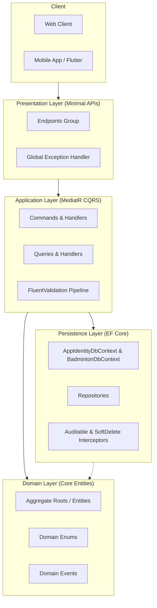
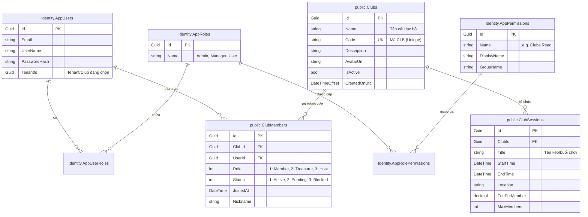
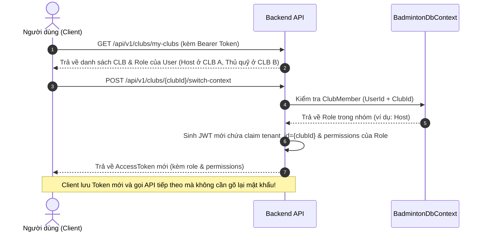

# 📘 Tài Liệu Kiến Trúc & Hướng Dẫn Phát Triển (Development Guide)

Tài liệu này là cẩm nang phát triển chính thức cho toàn bộ dự án **LegendsTeamVN.BadmintonClub**. Tất cả kỹ sư phần mềm khi tham gia phát triển backend cần đọc kỹ và tuân thủ các quy tắc dưới đây.

---

## 📑 Mục Lục
1. [Kiến Trúc Hệ Thống (Clean Architecture & CQRS)](#1-kiến-trúc-hệ-thống-clean-architecture--cqrs)
2. [Cấu Trúc Cơ Sở Dữ Liệu (Multi-DbContext Design)](#2-cấu-trúc-cơ-sở-dữ-liệu-multi-dbcontext-design)
3. [Chuẩn Thiết Kế RESTful API](#3-chuẩn-thiết-kế-restful-api)
4. [Phân Quyền Hệ Thống & Quản Trị Đa Nhóm (RBAC & Multi-Group)](#4-phân-quyền-hệ-thống--quản-trị-đa-nhóm-rbac--multi-group)
5. [Hướng Dẫn Tạo Một Module / Tính Năng Mới](#5-hướng-dẫn-tạo-một-module--tính-năng-mới)
6. [Lệnh Thường Dùng & Kiểm Thử](#6-lệnh-thường-dùng--kiểm-thử)

---

## 1. Kiến Trúc Hệ Thống (Clean Architecture & CQRS)

Dự án được xây dựng trên nền tảng **.NET 10**, tuân thủ nguyên lý **Clean Architecture** và mô hình **CQRS** thông qua **MediatR**.



### 1.1. Các Tầng (Layers) và Ràng Buộc:
1. **Domain Layer (`Core.Domain`, `BadmintonClub.Domain`)**:
   - Trái tim của hệ thống. Chứa Entities, Enums, Aggregate Roots, Domain Events.
   - **Ràng buộc tuyệt đối**: KHÔNG phụ thuộc vào bất kỳ thư viện bên ngoài nào (không Entity Framework, không ASP.NET Core).
2. **Application Layer (`Core.Application`, `BadmintonClub.Application`)**:
   - Chứa Use Cases dạng CQRS (Commands/Queries), DTOs, FluentValidation Validators, và các Interface abstraction.
   - **Ràng buộc**: Chỉ phụ thuộc vào tầng Domain.
3. **Persistence & Infrastructure Layer (`Core.Persistence`, `BadmintonClub.Persistence`, `Infrastructure`)**:
   - Triển khai DbContext, EF Core configurations, Repositories, Redis Caching, RabbitMQ Message Bus, Firebase Notifications.
   - **Ràng buộc**: Triển khai các interface từ Domain/Application.
4. **Presentation Layer (`Core.Presentation`, `BadmintonClub.Presentation`)**:
   - Định nghĩa các Endpoint RESTful (Minimal APIs kế thừa `EndpointGroupBase`), phân quyền endpoint (`.RequirePermission(...)`).
5. **Hosts (`API`, `Migrator`)**:
   - `BadmintonClub.API`: Điểm khởi chạy Web API (DI container, Middleware pipeline).
   - `BadmintonClub.Migrator`: Worker độc lập chuyên chạy Migration và nạp dữ liệu Seeder.

### 1.2. Luồng Xử Lý Một Request:
1. **Client** gửi HTTP Request tới Endpoint (ví dụ: `POST /api/v1/clubs`).
2. **Endpoint** đóng gói dữ liệu thành `Command` / `Query` rồi gọi `sender.Send(command)`.
3. **MediatR Pipeline** tự động kích hoạt `ValidationBehavior` (chạy FluentValidation). Nếu dữ liệu không hợp lệ, trả về HTTP 400 ngay lập tức.
4. **Handler** nhận request, tương tác với Domain Entity và Repository để xử lý nghiệp vụ.
5. **Result Pattern**: Handler luôn trả về `Result<T>` hoặc `Result.Failure(...)` (không dùng `throw Exception` để kiểm soát luồng nghiệp vụ).
6. **Endpoint** dùng `result.Match(...)` để map thành HTTP Response chuẩn (200, 201, 400, 404...).

---

## 2. Cấu Trúc Cơ Sở Dữ Liệu (Multi-DbContext Design)

Hệ thống sử dụng **PostgreSQL** và chia thành 2 DbContext tách biệt nhằm đảm bảo nguyên lý Separation of Concerns:

1. **`AppIdentityDbContext` (Schema `Identity`)**: Quản lý tài khoản toàn cục, authentication, danh mục quyền và vai trò hệ thống.
2. **`BadmintonDbContext` (Schema `public`)**: Quản lý toàn bộ nghiệp vụ câu lạc bộ cầu lông, thành viên theo nhóm và các buổi hoạt động.

### Sơ Đồ Thực Thể - Liên Kết (ERD):



### Các Quy Tắc Thiết Kế Database Bắt Buộc:
1. **Khóa chính**: Luôn là `Guid` (`uniqueidentifier`).
2. **Xóa mềm (Soft Delete)**: Kế thừa `SoftDeletableEntity<Guid>` hoặc `AggregateRoot<Guid>`. EF Core Interceptor tự động gán `IsDeleted = true` và áp dụng Global Query Filter.
3. **Audit Trails**: Mọi entity kế thừa `AuditableEntity<Guid>` đều tự động được ghi nhận `CreatedOnUtc`, `CreatedBy`, `ModifiedOnUtc`, `ModifiedBy`.
4. **Unique Constraint**: Bảng `ClubMembers` có Unique Index trên cặp `(ClubId, UserId)` để 1 người chỉ có 1 vai trò duy nhất trong 1 nhóm.

---

## 3. Chuẩn Thiết Kế RESTful API

### 3.1. Quy Ước Đặt Tên (Naming Conventions):
- Sử dụng danh từ số nhiều (Plural nouns), viết thường, nối bằng gạch ngang (`kebab-case`).
- Không đặt động từ vào URL.
  - ✅ `POST /api/v1/clubs` (Tạo nhóm)
  - ✅ `GET /api/v1/clubs/my-clubs` (Lấy danh sách nhóm của tôi)
  - ✅ `POST /api/v1/clubs/{id}/switch-context` (Chuyển context nhóm)
  - ❌ `POST /api/v1/clubs/create` (Anti-pattern)

### 3.2. Chuẩn Hóa Trả Về (Result Pattern):
Không bọc dữ liệu thành công trong các wrapper dư thừa (như `{ "success": true, "data": ... }`). Dùng trực tiếp HTTP Status Code gốc và DTO:

```csharp
private static async Task<IResult> GetClubById(Guid id, ISender sender, CancellationToken ct)
{
    var result = await sender.Send(new GetClubByIdQuery(id), ct);
    return result.Match(onSuccess: club => Results.Ok(club));
}
```

### 3.3. Bảng Mã Trạng Thái HTTP:
| Mã HTTP | Tình huống sử dụng |
| :--- | :--- |
| **`200 OK`** | Thành công và có trả về dữ liệu (`GET`, `PUT`). |
| **`201 Created`** | Tạo mới tài nguyên thành công (`POST`). |
| **`204 NoContent`** | Thao tác thành công nhưng không có body trả về (`DELETE`). |
| **`400 BadRequest`** | Dữ liệu đầu vào sai định dạng hoặc vi phạm quy tắc validation. |
| **`401 Unauthorized`** | Chưa đăng nhập hoặc Token JWT không hợp lệ / hết hạn. |
| **`403 Forbidden`** | Đã đăng nhập nhưng không có quyền hạn (Permission/Role). |
| **`404 NotFound`** | Bản ghi không tồn tại trong hệ thống. |
| **`409 Conflict`** | Xung đột dữ liệu (Trùng mã code, trùng email...). |
| **`500 InternalServerError`** | Lỗi server chưa được bắt, tự động chuyển thành format `ProblemDetails` chuẩn RFC 7807. |

---

## 4. Phân Quyền Hệ Thống & Quản Trị Đa Nhóm (RBAC & Multi-Group)

Hệ thống kết hợp 2 cấp độ phân quyền:
1. **Cấp Toàn Cục (Global System RBAC)**: Quản lý quyền hệ thống thông qua `AppRoles` (`Admin`, `Manager`, `User`) và bảng danh mục quyền `AppPermissions`.
2. **Cấp Nhóm / Câu Lạc Bộ (Multi-Group RBAC - FR03, FR04)**: Một user có thể tham gia nhiều CLB với vai trò độc lập theo từng CLB:
   - **Host (Chủ nhóm)**: Toàn quyền quản lý nhóm, thành viên, phân vai trò, buổi hoạt động.
   - **Treasurer (Thủ quỹ)**: Quản lý quỹ, thu chi, thành viên.
   - **Member (Thành viên chính thức)**: Xem lịch, đăng ký tham gia kèo.
   - **Guest (Khách vãng lai)**: Người chơi vãng lai tham gia giao lưu theo buổi.

### Danh Sách API Quản Trị Đa Nhóm & Phân Quyền (FR03):
| Method | Endpoint | Quyền / Điều kiện | Mô tả |
| :--- | :--- | :--- | :--- |
| `GET` | `/api/v1/clubs/my-clubs` | Đã đăng nhập | Xem toàn bộ các nhóm User đang tham gia kèm vai trò độc lập theo từng nhóm |
| `POST` | `/api/v1/clubs/join` | Đã đăng nhập | Tham gia nhóm bằng mã code với vai trò `Member` hoặc `Guest` |
| `GET` | `/api/v1/clubs/{id}/members` | Đã đăng nhập | Xem danh sách thành viên trong nhóm kèm vai trò của từng người |
| `PUT` | `/api/v1/clubs/{id}/members/{userId}/role` | Chỉ Host | Cập nhật vai trò thành viên (`Host`, `Treasurer`, `Member`, `Guest`) |
| `DELETE` | `/api/v1/clubs/{id}/members/{userId}` | Thành viên / Host | Tự rời nhóm hoặc Host xóa thành viên khỏi nhóm |
| `POST` | `/api/v1/clubs/{id}/switch-context` | Thành viên nhóm | Chuyển đổi ngữ cảnh sang nhóm đã chọn, cấp AccessToken mới chứa quyền của vai trò trong nhóm đó |

### Luồng Chuyển Đổi Nhóm (Switch Context) Không Cần Đăng Nhập Lại:



---

## 5. Hướng Dẫn Tạo Một Module / Tính Năng Mới

Mỗi khi tạo mới một tính năng trong hệ thống, thực hiện theo đúng 5 bước sau:

### Bước 1: Khai báo Entity & Configuration
- Tạo Entity tại `src/LegendsTeamVN.BadmintonClub.Domain/Entities/` (kế thừa `AggregateRoot<Guid>` hoặc `SoftDeletableEntity<Guid>`).
- Cấu hình EF Core Fluent API tại `src/LegendsTeamVN.BadmintonClub.Persistence/Configurations/`.
- Đăng ký `DbSet<T>` vào `BadmintonDbContext`.

### Bước 2: Khai báo Repository (Nếu cần)
- Khai báo Interface kế thừa `IGenericRepository<T, Guid>` trong `Domain/Repositories`.
- Implement Repository kế thừa `GenericRepository<BadmintonDbContext, T, Guid>` trong `Persistence/Repositories`.
- Đăng ký Scoped trong `ServiceCollectionExtensions.cs` của tầng Persistence.

### Bước 3: Viết CQRS (Application Layer)
- Tạo thư mục Feature trong `Application/Features/{Module}/{Action}/`:
  - `Command/Query`: Record triển khai `ICommand<TResult>` hoặc `IQuery<TResult>`.
  - `Validator`: Kế thừa `AbstractValidator<TCommand>` (đặt tên kết thúc bằng `Validator`, `sealed`).
  - `Handler`: Kế thừa `ICommandHandler<TCommand, TResult>` (đặt tên kết thúc bằng `CommandHandler`, `sealed`).

### Bước 4: Đăng ký Permission (Nếu tính năng cần bảo vệ)
- Khai báo quyền trong [AppPermissions.cs](file:///c:/code/abp_be/LegendsTeamVN.BadmintonClub/src/BuildingBlocks/LegendsTeamVN.Core.Identity/Authorization/AppPermissions.cs).
- Quyền sẽ tự động được đồng bộ vào database khi chạy Migrator.

### Bước 5: Viết Endpoint (Presentation Layer)
- Tạo Endpoint kế thừa `EndpointGroupBase` trong `Presentation/Endpoints/`.
- Gắn `.RequirePermission(AppPermissions.{Module}.{Action})` hoặc `.RequireAuthorization()`.
- Endpoint sẽ được tự động phát hiện và đăng ký vào Minimal API router.

---

## 6. Lệnh Thường Dùng & Kiểm Thử

### 6.1. Quản lý Hạ Tầng (Docker):
```bash
# Bật PostgreSQL, Redis, RabbitMQ
docker compose -f infrastructure/docker-compose.yml up -d

# Tắt hạ tầng
docker compose -f infrastructure/docker-compose.yml down
```

### 6.2. Tạo & Chạy Migration:
```bash
# Tạo Migration mới cho BadmintonDbContext
dotnet ef migrations add <TenMigration> -c BadmintonDbContext -p src/Hosts/LegendsTeamVN.BadmintonClub.Migrator -s src/Hosts/LegendsTeamVN.BadmintonClub.Migrator -o Migrations

# Chạy Migrator và nạp dữ liệu Seeder
dotnet run --project src/Hosts/LegendsTeamVN.BadmintonClub.Migrator
```

### 6.3. Chạy Kiểm Thử Kiến Trúc & Build:
```bash
# Chạy toàn bộ Unit & Architecture Tests
dotnet test

# Build toàn bộ Solution
dotnet build
```

### 6.4. Khởi Động API & Truy Cập Swagger:
```bash
dotnet run --project src/Hosts/LegendsTeamVN.BadmintonClub.API
```
- **Swagger UI**: `http://localhost:54796/swagger`
- **Tài khoản Admin kiểm thử mặc định**:
  - Username: `admin` (hoặc `admin@admin.com`)
  - Password: `admin`
