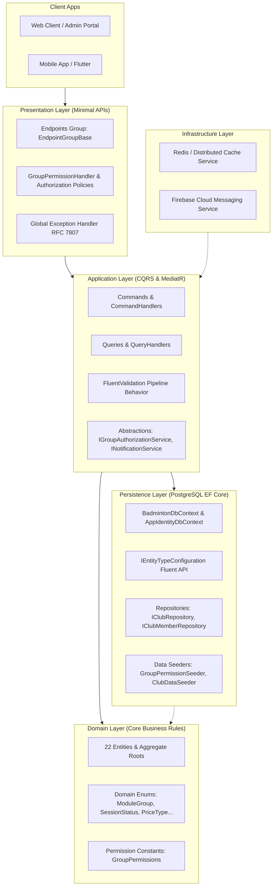
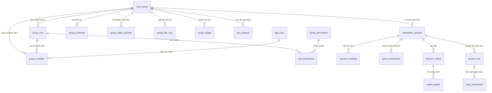

# 📘 Tài Liệu Kiến Trúc & Hướng Dẫn Phát Triển (Development Guide)

Tài liệu này là cẩm nang phát triển chính thức cho toàn bộ dự án **LegendsTeamVN.BadmintonClub**. Tất cả kỹ sư phần mềm khi tham gia phát triển backend cần đọc kỹ và tuân thủ các quy tắc dưới đây.

---

## 📑 Mục Lục
1. [Kiến Trúc Hệ Thống (Clean Architecture & CQRS)](#1-kiến-trúc-hệ-thống-clean-architecture--cqrs)
2. [Cấu Trúc Cơ Sở Dữ Liệu (Mô Hình ERD 22 Bảng Chuẩn Hóa)](#2-cấu-trúc-cơ-sở-dữ-liệu-mô-hình-erd-22-bảng-chuẩn-hóa)
3. [Hệ Thống Phân Quyền Đa Nhóm (Multi-Group Dynamic RBAC)](#3-hệ-thống-phân-quyền-đa-nhóm-multi-group-dynamic-rbac)
4. [Chuẩn Thiết Kế RESTful Minimal API](#4-chuẩn-thiết-kế-restful-minimal-api)
5. [Quy Trình Phát Triển Tính Năng Mới (Feature Workflow)](#5-quy-trình-phát-triển-tính-năng-mới-feature-workflow)
6. [Lệnh Thao Tác, Di Trú Dữ Liệu & Kiểm Thử](#6-lệnh-thao-tác-di-trú-dữ-liệu--kiểm-thử)

---

## 1. Kiến Trúc Hệ Thống (Clean Architecture & CQRS)

Dự án được xây dựng trên nền tảng **.NET 10**, tuân thủ nghiêm ngặt nguyên lý **Clean Architecture**, **Domain-Driven Design (DDD)** và mô hình **CQRS** thông qua **MediatR**.



### 1.1. Các Tầng (Layers) và Ràng Buộc Kiến Trúc:
1. **Domain Layer (`LegendsTeamVN.BadmintonClub.Domain`)**:
   - Trái tim của hệ thống. Chứa 22 thực thể cốt lõi, Domain Enums, Constants quyền hạn, Aggregate Roots.
   - **Ràng buộc tuyệt đối**: KHÔNG phụ thuộc vào bất kỳ tầng nào khác và không phụ thuộc thư viện bên ngoài (không EF Core, không ASP.NET Core).
2. **Application Layer (`LegendsTeamVN.BadmintonClub.Application`)**:
   - Hiện thực các ca sử dụng (Use Cases) theo mẫu CQRS (Commands, Queries, DTOs, Handlers).
   - Tự động chạy Validation pipeline (`FluentValidation`).
   - Định nghĩa các interface giao tiếp hạ tầng (`IGroupAuthorizationService`, `INotificationService`).
   - **Ràng buộc**: Chỉ phụ thuộc vào tầng Domain và BuildingBlocks Core.
3. **Persistence Layer (`LegendsTeamVN.BadmintonClub.Persistence`)**:
   - Quản trị kết nối cơ sở dữ liệu PostgreSQL qua `BadmintonDbContext`.
   - Cấu hình EntityTypeConfiguration chi tiết cho từng bảng (kiểu dữ liệu SQL, constraints, index, defaults).
   - Triển khai `IGroupAuthorizationService` có kết hợp cache và các Seeder dữ liệu mẫu.
4. **Presentation Layer (`LegendsTeamVN.BadmintonClub.Presentation`)**:
   - Xây dựng HTTP Endpoints bằng **ASP.NET Core Minimal APIs** (kế thừa `EndpointGroupBase`).
   - Cung cấp `GroupPermissionHandler` và extension `.RequireGroupPermission(...)` để kiểm tra phân quyền động theo nhóm.
5. **Hosts Project**:
   - `BadmintonClub.API`: Ứng dụng Web API chính chạy dịch vụ.
   - `BadmintonClub.Migrator`: Worker độc lập chuyên chạy `Database.MigrateAsync()` và kích hoạt toàn bộ `IDataSeeder`.

---

## 2. Cấu Trúc Cơ Sở Dữ Liệu (Mô Hình ERD 22 Bảng Chuẩn Hóa)

Hệ thống sử dụng **PostgreSQL** với 2 DbContext độc lập:
1. **`AppIdentityDbContext` (Schema `Identity`)**: Quản trị tài khoản danh tính toàn cục (`AppUser`, `AppRole`, `AppUserRole`, refresh token).
2. **`BadmintonDbContext` (Schema `public`)**: Quản trị toàn bộ 22 bảng nghiệp vụ câu lạc bộ cầu lông.

### 2.1. Phân Nhóm 22 Bảng Nghiệp Vụ:
- **Người dùng & Tương tác**: `app_user`, `user_device`, `notification`, `member_review`, `group_review`.
- **Câu lạc bộ & Cấu hình**: `club_group`, `group_schedule`, `group_bank_account`, `group_fee_rule`.
- **Thành viên & Phân quyền nhóm**: `group_role`, `group_permission`, `role_permission`, `group_member`, `join_request`.
- **Buổi sinh hoạt & Thi đấu**: `badminton_session`, `session_booking`, `guest_recruitment`, `session_match`, `match_player`.
- **Tài chính & Quỹ**: `session_fee`, `bank_transaction`, `group_ledger`.



### 2.2. Bảng Chuẩn Hóa Domain Enums & Kiểu Dữ Liệu:

| Tên Bảng | Tên Cột | Kiểu Dữ Liệu SQL | Nullable | Default Value | Enum / Miền Giá Trị |
| :--- | :--- | :--- | :--- | :--- | :--- |
| `app_user` | `skill_level` | `SMALLINT` | NOT NULL | `1` | `SkillLevel`: `NB=1`, `TB_Y=2`, `TB=3`, `TB_K=4`, `K=5`, `CHUYEN_NGHIEP=6` |
| `user_device` | `platform` | `VARCHAR(20)` | NULL | - | `DevicePlatform`: `ANDROID=1`, `IOS=2` |
| `notification` | `type` | `VARCHAR(50)` | NOT NULL | - | `NotificationType`: `SESSION=1`, `MATCH=2`, `FEE=3`, `JOIN_REQUEST=4`, `GUEST_RECRUIT=5` |
| `group_permission` | `module_group` | `VARCHAR(50)` | NOT NULL | - | `ModuleGroup`: `OPERATIONS=1`, `FINANCE=2`, `MEMBER=3` |
| `group_member` | `status` | `VARCHAR(50)` | NOT NULL | `'ACTIVE'` | `ClubMemberStatus`: `ACTIVE=1`, `LEAVED=2`, `BANNED=3` |
| `group_fee_rule` | `fee_mode` | `VARCHAR(50)` | NOT NULL | `'DYNAMIC'` | `FeeMode`: `DYNAMIC=1`, `FIXED=2` |
| `join_request` | `status` | `VARCHAR(50)` | NOT NULL | `'PENDING'` | `JoinRequestStatus`: `PENDING=1`, `APPROVED=2`, `REJECTED=3` |
| `badminton_session` | `status` | `VARCHAR(50)` | NOT NULL | `'OPEN'` | `SessionStatus`: `OPEN=1`, `LOCKED=2`, `PLAYING=3`, `CALCULATED=4`, `COMPLETED=5` |
| `session_booking` | `status` | `VARCHAR(50)` | NOT NULL | `'CONFIRMED'` | `BookingStatus`: `CONFIRMED=1`, `WAITING=2`, `CANCELLED=3`, `CHECKED_IN=4` |
| `guest_recruitment` | `status` | `VARCHAR(50)` | NOT NULL | `'ACTIVE'` | `GuestRecruitmentStatus`: `ACTIVE=1`, `FILLED=2`, `EXPIRED=3` |
| `session_match` | `status` | `VARCHAR(50)` | NOT NULL | `'WAITING'` | `MatchStatus`: `WAITING=1`, `PLAYING=2`, `COMPLETED=3`, `SKIPPED=4` |
| `match_player` | `side_team` | `VARCHAR(20)` | NOT NULL | `'TEAM_A'` | `SideTeam`: `TEAM_A=1`, `TEAM_B=2` |
| `session_fee` | `price_type` | `VARCHAR(50)` | NOT NULL | - | `PriceType`: `MONTHLY_MEMBER=1`, `DAILY_MEMBER=2`, `GUEST=3` |
| `session_fee` | `payment_method` | `VARCHAR(50)` | NULL | - | `PaymentMethod`: `BANK_TRANSFER=1`, `CASH=2` |
| `session_fee` | `payment_status` | `VARCHAR(50)` | NOT NULL | `'UNPAID'` | `PaymentStatus`: `UNPAID=1`, `PAID=2`, `EXEMPT=3` |
| `bank_transaction` | `reconciliation_status` | `VARCHAR(50)` | NOT NULL | `'MATCHED'` | `ReconciliationStatus`: `MATCHED=1`, `MANUAL_CHECK=2` |
| `group_ledger` | `transaction_type` | `VARCHAR(50)` | NOT NULL | - | `TransactionType`: `INFLOW=1`, `OUTFLOW=2` |
| `group_ledger` | `category` | `VARCHAR(50)` | NOT NULL | - | `LedgerCategory`: `SESSION_FEE=1`, `COURT_RENT=2`, `SHUTTLE_EXPENSE=3`, `MONTHLY_FUND=4`, `OTHER=5` |

### 2.3. Quy Định Tuyệt Đối Về Mô Hình Dữ Liệu:
1. **Không dùng Aliases**: Không dùng các alias `Club`, `ClubMember`, `ClubSession`. Toàn bộ codebase dùng trực tiếp các tên chuẩn domain: `ClubGroup`, `GroupMember`, `BadmintonSession`.
2. **Không tạo thuộc tính nhân đôi**: Thuộc tính điều hướng và khóa ngoại là duy nhất (`GroupId`, `Group`), tuyệt đối không tạo thêm thuộc tính bắc cầu như `ClubId => GroupId` hoặc `Club => Group`.
3. **Mã hóa Enum sang String**: Các cột enum dạng chuỗi được chuyển đổi qua `.HasConversion<string>()` và luôn cấu hình `.HasSentinel((TEnum)0)` khi có giá trị mặc định.

---

## 3. Hệ Thống Phân Quyền Đa Nhóm (Multi-Group Dynamic RBAC)

Hệ thống tách biệt hoàn toàn giữa **Authentication** và **Group Authorization**:
- **Authentication**: Xác thực người dùng toàn cục qua `AppUser` của ASP.NET Core Identity.
- **Group Authorization**: Quyền hạn của người dùng được giới hạn theo từng câu lạc bộ cụ thể (`group_member` $\rightarrow$ `group_role` $\rightarrow$ `role_permission` $\rightarrow$ `group_permission`).

```
1 Người Dùng (UserId)
   ├── Tham gia CLB A: Vai trò "Chủ phòng"  --> Full quyền OPERATIONS, FINANCE, MEMBER
   ├── Tham gia CLB B: Vai trò "Thủ quỹ"   --> Quyền FINANCE + Xem thành viên, buổi chơi
   └── Tham gia CLB C: Vai trò "Thành viên" --> Quyền xem lịch, đặt chỗ kèo đấu
```

### 3.1. Danh Mục Quyền Chuẩn Hóa (`GroupPermissions`):
- **OPERATIONS**:
  - `OPERATIONS.SESSION.VIEW`: Xem danh sách và chi tiết các buổi sinh hoạt cầu lông.
  - `OPERATIONS.SESSION.CREATE`: Lên lịch và tạo buổi sinh hoạt mới.
  - `OPERATIONS.SESSION.UPDATE`: Chỉnh sửa thời gian, địa điểm, số sân.
  - `OPERATIONS.SESSION.DELETE`: Hủy / xóa buổi sinh hoạt.
  - `OPERATIONS.BOOKING.MANAGE`: Quản lý danh sách đặt chỗ, duyệt và điểm danh người chơi.
  - `OPERATIONS.MATCH.MANAGE`: Tạo trận đấu, xếp cặp thi đấu, ghi nhận tỉ số.
  - `OPERATIONS.RECRUIT.MANAGE`: Đăng tin tuyển khách vãng lai và quản lý lượt đăng ký.
- **FINANCE**:
  - `FINANCE.LEDGER.VIEW`: Xem sổ quỹ thu chi và số dư quỹ nhóm.
  - `FINANCE.LEDGER.CREATE`: Ghi nhận giao dịch thu chi quỹ.
  - `FINANCE.FEE.VIEW`: Xem danh sách và trạng thái nộp hội phí buổi chơi.
  - `FINANCE.FEE.MANAGE`: Xác nhận nộp tiền, miễn giảm hoặc kiểm tra đối soát ngân hàng.
  - `FINANCE.BANK.MANAGE`: Cấu hình tài khoản ngân hàng nhận tiền của nhóm.
  - `FINANCE.FEERULE.MANAGE`: Thiết lập đơn giá cố định hoặc linh hoạt theo sân/cầu.
- **MEMBER**:
  - `MEMBER.LIST.VIEW`: Xem danh sách thành viên và khách trong nhóm.
  - `MEMBER.INVITE.MANAGE`: Duyệt hoặc từ chối đơn xin gia nhập câu lạc bộ.
  - `MEMBER.ROLE.MANAGE`: Phân vai trò hoặc thay đổi quyền hạn của thành viên.
  - `MEMBER.REMOVE`: Xóa hoặc cấm thành viên rời khỏi câu lạc bộ.
  - `MEMBER.GROUP.UPDATE`: Thay đổi thông tin nhóm (tên, avatar, địa chỉ sân cố định).

### 3.2. Dịch Vụ Kiểm Tra Quyền Động & Caching (`IGroupAuthorizationService`):
Quyền của mỗi thành viên trong nhóm được lưu cache (Redis / In-Memory) với TTL 10 phút theo cấu trúc khóa:
```text
group:perm:{userId}:{groupId}
```
Khi có thao tác thay đổi vai trò (`UpdateMemberRoleCommandHandler`), hệ thống tự động xóa cache thông qua `InvalidateUserPermissionsCacheAsync(userId, groupId)` để quyền mới có hiệu lực ngay lập tức.

### 3.3. Bảo Vệ Endpoint Bằng `.RequireGroupPermission(...)`:
Mọi Endpoint yêu cầu quyền nhóm được cấu hình trực quan qua `GroupPermissionHandler`:
```csharp
// Tự động trích xuất groupId từ Route ({id:guid}, {groupId:guid}) hoặc Header X-Group-Id
group.MapGet("{id:guid}/members", GetClubMembers)
    .RequireGroupPermission(GroupPermissions.Member.ListView);

group.MapPut("{id:guid}/members/{userId:guid}/role", UpdateMemberRole)
    .RequireGroupPermission(GroupPermissions.Member.RoleManage);
```

---

## 4. Chuẩn Thiết Kế RESTful Minimal API

### 4.1. Quy Ước Đặt Tên Endpoint (RESTful Naming):
- Dùng danh từ số nhiều (Plural nouns), chữ thường, nối bằng gạch ngang (`kebab-case`).
- Không đặt động từ vào URL:
  - ✅ `POST /api/v1/clubs` (Tạo câu lạc bộ)
  - ✅ `GET /api/v1/clubs/my-clubs` (Lấy danh sách câu lạc bộ của tôi)
  - ✅ `GET /api/v1/clubs/{id}/members` (Lấy danh sách thành viên của CLB)
  - ❌ `POST /api/v1/clubs/create` (Anti-pattern)

### 4.2. Xử Lý Kết Quả Chuẩn Hóa (Result Pattern):
Handlers luôn trả về `Result<T>` hoặc `Result.Failure(Error)`. Endpoint map trực tiếp HTTP Status:
```csharp
private static async Task<IResult> GetClubMembers(
    [FromRoute] Guid id,
    ISender sender,
    CancellationToken cancellationToken)
{
    var query = new GetClubMembersQuery(id);
    var result = await sender.Send(query, cancellationToken);
    return result.Match(onSuccess: members => Results.Ok(members));
}
```

### 4.3. Bảng Mã Trạng Thái HTTP:
| Mã HTTP | Ý Nghĩa & Tình Huống Áp Dụng |
| :--- | :--- |
| **`200 OK`** | Yêu cầu thành công, trả về body dữ liệu (`GET`, `PUT`). |
| **`201 Created`** | Tạo mới tài nguyên thành công (`POST`). |
| **`204 NoContent`** | Thao tác thành công nhưng không có body trả về (`DELETE`). |
| **`400 BadRequest`** | Dữ liệu đầu vào sai định dạng hoặc vi phạm FluentValidation. |
| **`401 Unauthorized`** | Chưa đăng nhập hoặc Token JWT không hợp lệ / hết hạn. |
| **`403 Forbidden`** | Đã đăng nhập nhưng không đủ quyền hạn trong nhóm yêu cầu. |
| **`404 NotFound`** | Không tìm thấy tài nguyên theo Id yêu cầu. |
| **`409 Conflict`** | Xung đột dữ liệu (Trùng mã code CLB, trùng email...). |
| **`500 InternalServerError`** | Lỗi server chưa xử lý, format chuẩn RFC 7807 `ProblemDetails`. |

---

## 5. Quy Trình Phát Triển Tính Năng Mới (Feature Workflow)

Khi bổ sung bất kỳ tính năng hoặc nghiệp vụ mới nào, kỹ sư cần thực hiện theo đúng 5 bước:

1. **Bước 1: Khai báo Entity & Fluent API Configuration**:
   - Khai báo Entity kế thừa `AggregateRoot<Guid>` hoặc `Entity<Guid>` trong `src/LegendsTeamVN.BadmintonClub.Domain/Entities/`.
   - Cấu hình bảng, cột, kiểu dữ liệu SQL trong `src/LegendsTeamVN.BadmintonClub.Persistence/Configurations/`.
   - Đăng ký `DbSet<T>` vào `BadmintonDbContext`.
2. **Bước 2: Khai báo Quyền Hạn (Nếu là chức năng nhóm mới)**:
   - Thêm hằng số quyền vào `GroupPermissions.cs` tương ứng `OPERATIONS`, `FINANCE`, hoặc `MEMBER`.
   - Đăng ký mô tả quyền vào danh sách `GroupPermissions.All` để Seeder tự động nạp vào database.
3. **Bước 3: Viết CQRS Use Case (Application Layer)**:
   - Tạo thư mục `src/LegendsTeamVN.BadmintonClub.Application/Features/{Module}/{FeatureName}/`.
   - Viết `Command` / `Query` record.
   - Viết `Validator` kế thừa `AbstractValidator<TCommand>`.
   - Viết `CommandHandler` / `QueryHandler` kế thừa `ICommandHandler` / `IQueryHandler`.
4. **Bước 4: Viết Endpoint (Presentation Layer)**:
   - Đăng ký endpoint trong `EndpointGroupBase`.
   - Sử dụng `.RequireGroupPermission(...)` để bảo vệ tài nguyên theo nhóm.
5. **Bước 5: Viết Unit / Architecture Test**:
   - Thêm bài kiểm tra kiến trúc và logic nghiệp vụ trong `tests/LegendsTeamVN.BadmintonClub.Architecture.Tests`.

---

## 6. Lệnh Thao Tác, Di Trú Dữ Liệu & Kiểm Thử

### 6.1. Quản Trị Hạ Tầng Local (Docker):
```bash
# Khởi động PostgreSQL, Redis, RabbitMQ
docker compose -f infrastructure/docker-compose.yml up -d

# Tắt hạ tầng
docker compose -f infrastructure/docker-compose.yml down
```

### 6.2. Di Trú Cơ Sở Dữ Liệu (EF Core Migrations):
```bash
# Tạo Migration mới cho BadmintonDbContext
dotnet ef migrations add <TenMigration> -c BadmintonDbContext -p src/Hosts/LegendsTeamVN.BadmintonClub.Migrator -s src/Hosts/LegendsTeamVN.BadmintonClub.Migrator -o Migrations

# Chạy Migrator để cập nhật database và nạp toàn bộ Seeder
dotnet run --project src/Hosts/LegendsTeamVN.BadmintonClub.Migrator
```

### 6.3. Kiểm Thử & Kiểm Tra Build:
```bash
# Chạy toàn bộ Unit & Architecture Tests (30/30 passed)
dotnet test

# Build toàn bộ Solution
dotnet build
```

### 6.4. Chạy API Server & Swagger UI:
```bash
dotnet run --project src/Hosts/LegendsTeamVN.BadmintonClub.API
```
- **Swagger Documentation**: `http://localhost:54796/swagger`
- **Tài khoản Quản trị viên mặc định**:
  - Tên đăng nhập: `admin` (hoặc `admin@admin.com`)
  - Mật khẩu: `admin`
