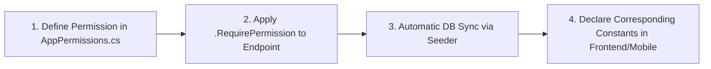

# 🛡️ Permission Standardization & New API Guidelines (RBAC Guidelines)

This document establishes the official standard workflow for creating new APIs and managing Role-Based Access Control (RBAC) across the **LegendsTeamVN.BadmintonClub** backend solution.

*[Đọc bản Tiếng Việt tại đây](PERMISSION_GUIDELINES.vi.md)*

---

## 📌 Standard 4-Step Workflow



---

## 1. Step 1: Declare Permissions in Backend

All system permissions are centrally maintained in:  
📁 `src/BuildingBlocks/LegendsTeamVN.Core.Identity/Authorization/AppPermissions.cs`

### 1.1. Naming Conventions:
* Format: `"{GroupName}.{Action}"` (PascalCase).
* **GroupName**: Module name (`Venues`, `Courts`, `VenueSchedules`, `CourtPricings`, `Users`, `Roles`, `Dashboard`, `Reports`).
* **Action**: Specific CRUD action:
  * `Read`: List / Detail queries.
  * `Create`: Insertion.
  * `Update`: Modifications.
  * `Delete`: Deletions.
  * `View`: Overview dashboard screens.

### 1.2. Update `AppPermissions.cs`:

1. Add constants:
```csharp
public static class Venues
{
    public const string Read = "Venues.Read";
    public const string Create = "Venues.Create";
    public const string Update = "Venues.Update";
    public const string Delete = "Venues.Delete";
}
```

2. Register flat metadata in `GetFlatPermissions()`:
```csharp
public static List<FlatPermissionDefinition> GetFlatPermissions() =>
[
    new(Venues.Read, "Xem danh sách cụm sân", "Venues", "Quyền xem danh sách và chi tiết các cụm sân"),
    new(Venues.Create, "Tạo cụm sân mới", "Venues", "Quyền tạo mới cụm sân cầu lông"),
    new(Venues.Update, "Cập nhật cụm sân", "Venues", "Quyền chỉnh sửa thông tin cụm sân"),
    new(Venues.Delete, "Xóa cụm sân", "Venues", "Quyền xóa cụm sân khỏi hệ thống"),
];
```

3. Register display name mapping in `GetGroupDisplayName(string groupName)`.

---

## 2. Step 2: Enforce Permission in Endpoint (Presentation Layer)

In the endpoint definition file (e.g., `src/LegendsTeamVN.BadmintonClub.Presentation/Endpoints/VenueEndpoint.cs`):

```csharp
public class VenueEndpoint : EndpointGroupBase
{
    protected override string Name => "venues";

    protected override void Map(RouteGroupBuilder group)
    {
        group.MapGet("", GetVenues)
             .WithName("GetVenues")
             .RequirePermission(AppPermissions.Venues.Read);

        group.MapPost("", CreateVenue)
             .WithName("CreateVenue")
             .RequirePermission(AppPermissions.Venues.Create);
    }
}
```

---

## 3. Step 3: Automatic Database Synchronization

Permissions are persisted in 2 dedicated tables in the `Identity` schema:
1. `Identity."AppPermissions"`: Permission catalog (`Id`, `Name`, `DisplayName`, `GroupName`, `Description`).
2. `Identity."AppRolePermissions"`: Role-Permission mapping with composite key `(RoleId, PermissionId)`.

### On API Startup:
* `IdentityDataSeeder.cs` runs automatically on `dotnet run`:
  * Inserts any new permissions declared in code into `Identity."AppPermissions"`.
  * Automatically grants new permissions to the `Admin` role in `Identity."AppRolePermissions"`.

---

## 4. Step 4: Pagination Parameter Rules (`SearchFilter`)

When creating paginated query APIs, always inherit from `SearchFilter`:

```csharp
public sealed record GetVenuesRequest : SearchFilter
{
    public string? Keyword { get; init; }
}
```

> [!IMPORTANT]
> `SortDirection?` in `SearchFilter` is nullable (`public SortDirection? SortDirection { get; set; } = Pagination.SortDirection.Descending;`) so that query strings omitting `sortDirection` will not trigger `BadHttpRequestException`.

---

## 5. Step 5: Frontend / Mobile Integration

Declare corresponding constants in Flutter/Web:
📁 `lib/app/consts/permissions.dart`:

```dart
class Permissions {
  static const String venuesRead = 'Venues.Read';
  static const String venuesCreate = 'Venues.Create';
}
```
