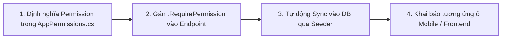

# 🛡️ Quy Tắc Chuẩn Hóa Phân Quyền & Tạo API Mới (RBAC API Guidelines)

Tài liệu này quy định quy trình chuẩn mực khi tạo mới một API và phân quyền trong toàn bộ hệ thống backend **LegendsTeamVN.BadmintonClub**. Tất cả các module phải tuân thủ nghiêm ngặt quy trình 4 bước này để đảm bảo tính đồng bộ, bảo mật và khả năng phân cấp động của hệ thống.

---

## 📌 Quy Trình 4 Bước Chuẩn Khi Tạo API Mới



---

## 1. Bước 1: Khai báo Permission trong Backend

Tất cả các quyền hạn trong hệ thống đều được quản lý tập trung tại file:  
📁 `src/BuildingBlocks/LegendsTeamVN.Core.Identity/Authorization/AppPermissions.cs`

### 1.1. Quy tắc đặt tên Permission:
* Định dạng: `"{GroupName}.{Action}"` (PascalCase).
* **GroupName**: Tên phân hệ (Ví dụ: `Venues`, `Courts`, `VenueSchedules`, `CourtPricings`, `Users`, `Roles`, `Dashboard`, `Reports`).
* **Action**: Hành động cụ thể:
  * `Read`: Xem danh sách / chi tiết.
  * `Create`: Tạo mới.
  * `Update`: Chỉnh sửa.
  * `Delete`: Xóa.
  * `View`: Dành cho trang tổng quan (Dashboard/Report).
  * `AssignRoles`, `AssignPermissions`, `ResetPassword`: Hành động đặc thù.

### 1.2. Khai báo trong `AppPermissions.cs`:

1. Thêm `const string` vào class module tương ứng:
```csharp
public static class Venues
{
    public const string Read = "Venues.Read";
    public const string Create = "Venues.Create";
    public const string Update = "Venues.Update";
    public const string Delete = "Venues.Delete";
}
```

2. Đăng ký metadata tiếng Việt vào hàm `GetFlatPermissions()`:
```csharp
public static List<FlatPermissionDefinition> GetFlatPermissions() =>
[
    // Module Venues
    new(Venues.Read, "Xem danh sách cụm sân", "Venues", "Quyền xem danh sách và chi tiết các cụm sân"),
    new(Venues.Create, "Tạo cụm sân mới", "Venues", "Quyền tạo mới cụm sân cầu lông"),
    new(Venues.Update, "Cập nhật cụm sân", "Venues", "Quyền chỉnh sửa thông tin cụm sân"),
    new(Venues.Delete, "Xóa cụm sân", "Venues", "Quyền xóa cụm sân khỏi hệ thống"),
];
```

3. Đăng ký tên hiển thị nhóm tiếng Việt vào hàm `GetGroupDisplayName(string groupName)`:
```csharp
public static string GetGroupDisplayName(string groupName) => groupName switch
{
    "System" => "Quản trị hệ thống",
    "Roles" => "Nhóm người dùng",
    "Users" => "Danh sách tài khoản",
    "Venues" => "Quản lý cụm sân",
    "Courts" => "Quản lý sân",
    "VenueSchedules" => "Quản lý lịch cụm sân",
    "CourtPricings" => "Quản lý bảng giá sân",
    "Dashboard" => "Dashboard",
    "Reports" => "Báo cáo thống kê",
    _ => groupName
};
```

---

## 2. Bước 2: Gán quyền cho Endpoint (Presentation Layer)

Tại file Endpoint của phân hệ (ví dụ: `src/LegendsTeamVN.BadmintonClub.Presentation/Endpoints/VenueEndpoint.cs`):

* Mọi route **bắt buộc** phải có `.RequirePermission(AppPermissions.{Module}.{Action})`.
* Endpoint chỉ xem công khai (Public) hoặc chỉ cần đăng nhập mà không phân quyền thì dùng `.AllowAnonymous()` hoặc `.RequireAuthorization()`.

```csharp
public class VenueEndpoint : EndpointGroupBase
{
    protected override string Name => "venues";

    protected override void Map(RouteGroupBuilder group)
    {
        // 1. GET ALL / CHI TIẾT
        group.MapGet("", GetVenues)
             .WithName("GetVenues")
             .WithSummary("Get list of venues")
             .RequirePermission(AppPermissions.Venues.Read);

        group.MapGet("{id:guid}", GetVenueById)
             .WithName("GetVenueById")
             .WithSummary("Get venue by ID")
             .RequirePermission(AppPermissions.Venues.Read);

        // 2. CREATE
        group.MapPost("", CreateVenue)
             .WithName("CreateVenue")
             .WithSummary("Create a new venue")
             .RequirePermission(AppPermissions.Venues.Create);

        // 3. UPDATE
        group.MapPut("{id:guid}", UpdateVenue)
             .WithName("UpdateVenue")
             .WithSummary("Update venue")
             .RequirePermission(AppPermissions.Venues.Update);

        // 4. DELETE
        group.MapDelete("{id:guid}", DeleteVenue)
             .WithName("DeleteVenue")
             .WithSummary("Delete venue")
             .RequirePermission(AppPermissions.Venues.Delete);
    }
}
```

---

## 3. Bước 3: Cơ Chế Tự Động Đồng Bộ Quyền (Database & Seeder)

Hệ thống lưu trữ quyền hạn trong 2 bảng riêng biệt trong database:
1. `Identity."AppPermissions"`: Bảng danh mục quyền (có `Id`, `Name`, `DisplayName`, `GroupName`, `Description`).
2. `Identity."AppRolePermissions"`: Bảng liên kết quyền của từng Role (khóa chính phức hợp `RoleId` + `PermissionId`).

### Cơ chế tự động khi khởi động API:
* Khi khởi động ứng dụng (`dotnet run`), `IdentityDataSeeder.cs` sẽ tự động:
  1. Đọc toàn bộ danh sách quyền từ `AppPermissions.GetFlatPermissions()`.
  2. Tự động `INSERT` các quyền mới vào bảng `Identity."AppPermissions"`.
  3. Cập nhật `DisplayName` và `GroupName` mới nhất nếu có thay đổi.
  4. Tự động gán quyền mới vào vai trò **`Admin`** trong bảng `Identity."AppRolePermissions"`.
* 👉 **Lập trình viên không cần viết migration SQL thủ công mỗi khi thêm quyền mới!** Chỉ cần khai báo ở Bước 1.

---

## 4. Bước 4: Quy Tắc Thiết Kế Query Tham Số Phân Trang (`SearchFilter`)

Khi tạo các API dạng danh sách (`GET /api/v1/{module}?pageNumber=1&pageSize=10`), luôn kế thừa từ `SearchFilter`:

```csharp
public sealed record GetVenuesRequest : SearchFilter
{
    public string? Keyword { get; init; }
}
```

> [!IMPORTANT]
> Trong `SearchFilter`, `SortDirection?` là **nullable** (`SortDirection? SortDirection = Pagination.SortDirection.Descending;`). 
> Tuyệt đối không dùng kiểu enum non-nullable vì ASP.NET Core Minimal API sẽ bắt buộc Client phải truyền tham số đó trên URL, gây lỗi `BadHttpRequestException (400/500)` cho Mobile/Web khi bỏ qua tham số sắp xếp.

---

## 5. Bước 5: Đồng Bộ Lên Frontend & Mobile

Khi thêm quyền mới ở Backend, hãy cập nhật ngay vào constants của Frontend/Mobile:

📁 `lib/app/consts/permissions.dart` (hoặc `app_permissions.dart`):

```dart
class Permissions {
  // ===== Venues =====
  static const String venuesRead = 'Venues.Read';
  static const String venuesCreate = 'Venues.Create';
  static const String venuesUpdate = 'Venues.Update';
  static const String venuesDelete = 'Venues.Delete';
}
```

Sử dụng widget `HasPermission` hoặc Navigation Item để bảo vệ UI:
```dart
HasPermission(
  permission: Permissions.venuesCreate,
  child: FloatingActionButton(
    onPressed: () => _openCreateDialog(context),
    child: const Icon(Icons.add),
  ),
)
```

---

## 📋 Checklist Khi Tạo Module Mới:

- [ ] 1. Khai báo hằng số trong `AppPermissions.cs`.
- [ ] 2. Đăng ký metadata tiếng Việt trong `GetFlatPermissions()`.
- [ ] 3. Đăng ký tên nhóm hiển thị trong `GetGroupDisplayName()`.
- [ ] 4. Gắn `.RequirePermission(AppPermissions...)` trên từng endpoint trong `...Endpoint.cs`.
- [ ] 5. Chạy `dotnet run` để hệ thống tự động đồng bộ vào database và gán cho Admin.
- [ ] 6. Cập nhật `permissions.dart` trên Mobile/Frontend.
